<style>
img[alt~="center"] {
  display: block;
  margin: 0 auto;
}

</style>

<!--
_class: lead
-->

# 犬でもわかる公開鍵入門

あかこう(@\_akakou)

---

# アジェンダ

<!--
_class: invert
-->

1. 暗号ってなんだろう
2. 共通鍵暗号方式
3. 共通鍵暗号方式の課題
4. 公開鍵暗号方式
5. 公開鍵暗号方式のメリット
6. $\bmod$の計算, 累乗の計算
7. DL 問題, DH 問題
8. Diffie-Helman 鍵共有

---

<!--
_class: lead

-->

## 基礎

公開鍵暗号ってなんだろう？

---

# 暗号ってなんだろう

特定の人物に秘密（平文）を共有したい
→ 第三者が通信文を見ても特別な知識なしでは、
　読めないように変換する


---

# 共通鍵暗号方式

- 暗号化と復号で同じ鍵を利用する暗号方式
- 送信者と受信者が事前に共通鍵（秘密鍵）を共有する必要がある


---

# 共通鍵暗号の例

- シーザー暗号：平文に対して、共通鍵分だけ
  アルファベット順でシフトする
  - 暗号化：ABC→DEF（共通鍵が 3）
  - 復号：DEF→ABC（共通鍵が 3）
- AES：現在標準とされる共通鍵暗号方式

---

# 共通鍵暗号方式の課題

- 相手ごとに鍵を作成する必要がある
  - $n$ 人が相互に暗号通信するのに必要な共通鍵数： $n(n-1)/2$
- 共通鍵を漏洩せずに配送することは難しい

&nbsp;&nbsp;&nbsp;&nbsp;&nbsp;&nbsp;&nbsp;&nbsp;&nbsp;&nbsp;&nbsp;&nbsp;

---

# 公開鍵暗号方式 1/3

公開鍵という漏洩しても構わない鍵を利用する暗号方式

- パターン１：秘密で共有された値を作る方式
  - DH 鍵共有
- パターン２：公開鍵で暗号化し秘密鍵で復号する方式
  - RSA 暗号方式
  - ElGamal 暗号方式

---

# 公開鍵暗号方式 2/3

- パターン 1: 公開鍵と秘密鍵を用いて、同じ秘密を作成（共有）する
  **→ この鍵を共通鍵暗号方式の共通鍵として利用する**


---

# 公開鍵暗号方式 3/3

- パターン 2: 公開鍵で暗号化し、秘密鍵で復号を行う暗号方式
- 受信者側が秘密鍵と公開鍵のペア（鍵ペア）を作り、公開鍵を公開



---

# 公開鍵暗号方式のメリット

- 秘密鍵の数はユーザ数の数で良い
  - $n$ 人が相互に暗号通信するのに必要な秘密鍵数： $n$
- 配送する公開鍵は、漏洩しても問題がない

&nbsp;&nbsp;&nbsp;&nbsp;&nbsp;&nbsp;&nbsp;&nbsp;&nbsp;&nbsp;&nbsp;&nbsp;&nbsp;&nbsp;&nbsp;&nbsp;&nbsp;&nbsp;&nbsp;&nbsp;&nbsp;

---

<!--
_class: lead

-->

## 仕組み編

Diffie-Helman 鍵共有の仕組み

---

# $\bmod$の計算 1/2

$a \bmod b$ ： $a$を$b$で割ったときの余り

$$10 \bmod 6 = 4$$
$$14 \bmod 3 = 2$$

```py
print(10 % 6)
# => 4

print(14 % 3)
#=> 2
```

---

# $\bmod$の計算 2/2

$$
\begin{aligned}
3 & \times 4 \bmod 5\\
  &= 12 \bmod 5 \\
  &= 2
\end{aligned}
$$

$$
\begin{aligned}
2^3 & \bmod 5\\
  &= 8 \bmod 5 \\
  &= 3
\end{aligned}
$$

---

# 累乗の計算

累乗の累乗

$$(a ^ x)^y \bmod n = a ^ {xy} \bmod n$$
$$(2^3)^2 \bmod 10 = 2 ^ {3 \times 2} \bmod 10 = 4$$

累乗同士の乗算

$$a^xa^y \bmod n = a ^ {x + y} \bmod n$$
$$2^3 \times 2^2 \bmod 10 = 2 ^ {3 + 2} \bmod 10 = 2$$

---

# DL （離散対数）問題

$y = a ^ x \bmod n$ において

簡単：$a, x, n$ から $y$ を求める、
難しい：$a, y, n$ から $x$ を求める

※簡単 → 高速に解くアルゴリズムがある
※難しい → 高速に解くアルゴリズムが見つかっていない

---

# DH 問題

簡単 1： $g$, $n$, $x$, $K_B$から $K_{AB}$を 求める
簡単 2： $g$, $n$, $y$, $K_A$から $K_{AB}$を 求める
難しい： $g$, $n$, $K_A$, $K_B$から $K_{AB}$を 求める

$$
\begin{aligned}
K_A = & g^x \bmod n ,\ \  K_B= g^y \bmod n \\
K_{AB} &= (K_A)^ y \bmod n \\
&= (K_B)^ x \bmod n \\
&= g^{xy} \bmod n
\end{aligned}
$$

---

# Diffie-Helman 鍵共有

DH 問題を利用して、二人で秘密の値を共有（生成）する
**→ この鍵を共通鍵暗号方式の共通鍵として利用する**

&nbsp;&nbsp;&nbsp;&nbsp;&nbsp;&nbsp;&nbsp;&nbsp;&nbsp;&nbsp;&nbsp;&nbsp;&nbsp;&nbsp;&nbsp;&nbsp;&nbsp;&nbsp;&nbsp;&nbsp;&nbsp;&nbsp;

---

# まとめ

#### 公開鍵暗号方式とは

公開鍵という漏洩しても構わない鍵を利用する暗号方式

- 秘密鍵の数が少なくすむ
- 配送する公開鍵は、漏洩しても問題がない

#### Diffie-Helman 鍵共有

DH 問題を利用して二人で同じ値を共有する方式
