<!--
_class: lead
-->

# 犬でもわかる公開鍵入門

あかこう(@\_akakou)

---

# アジェンダ

<!--
_class: invert
-->

1. 暗号ってなんだろう
2. 共通鍵暗号方式
3. 共通鍵暗号方式の課題
4. 公開鍵暗号方式
5. 数学の基礎
6. ElGamal 暗号

---

<!--
_class: lead

-->

## 素人編

公開鍵暗号ってなんだろう？

---

# 暗号ってなんだろう

特定の人物に秘密（平文）を共有したい。
→ 第三者が通信文を見ても特別な知識なしでは、
　読めないように変換する。

---

# 共通鍵暗号方式

- 暗号化と復号で同じ鍵を利用する暗号方式。
- 送信者と受信者が事前に共通鍵（秘密鍵）を共有する必要がある。

---

# 共通鍵暗号の例

- シーザー暗号：平文に対して、共通鍵分だけアルファベット順でシフトする．
  - 暗号化：ABC→DEF（共通鍵が 3）
  - 復号：DEF→ABC（共通鍵が 3）
- AES：現在標準とされる共通鍵暗号方式。

---

# 共通鍵暗号方式の課題

- 相手ごとに鍵を作成する必要がある。
  - $n$ 人が相互に暗号通信するのに必要な共通鍵数： $n(n-1)/2$
- 共通鍵を安全に配送することは難しい。

&nbsp;&nbsp;&nbsp;&nbsp;&nbsp;&nbsp;&nbsp;&nbsp;&nbsp;&nbsp;&nbsp;&nbsp;

---

# 公開鍵暗号方式

- 公開鍵で暗号化し、秘密鍵で復号を行う暗号方式。
  - 受信者側が秘密鍵と公開鍵のペアを作り、公開鍵を公開する。

---

# 公開鍵暗号方式のメリット

- 鍵の数はユーザ数の数で良い。
  - $n$ 人が相互に暗号通信するのに必要な秘密鍵数： $n$
- 配送する公開鍵は、漏洩しても問題がない。

&nbsp;&nbsp;&nbsp;&nbsp;&nbsp;&nbsp;&nbsp;&nbsp;&nbsp;&nbsp;&nbsp;&nbsp;&nbsp;&nbsp;&nbsp;&nbsp;&nbsp;&nbsp;&nbsp;&nbsp;&nbsp;
